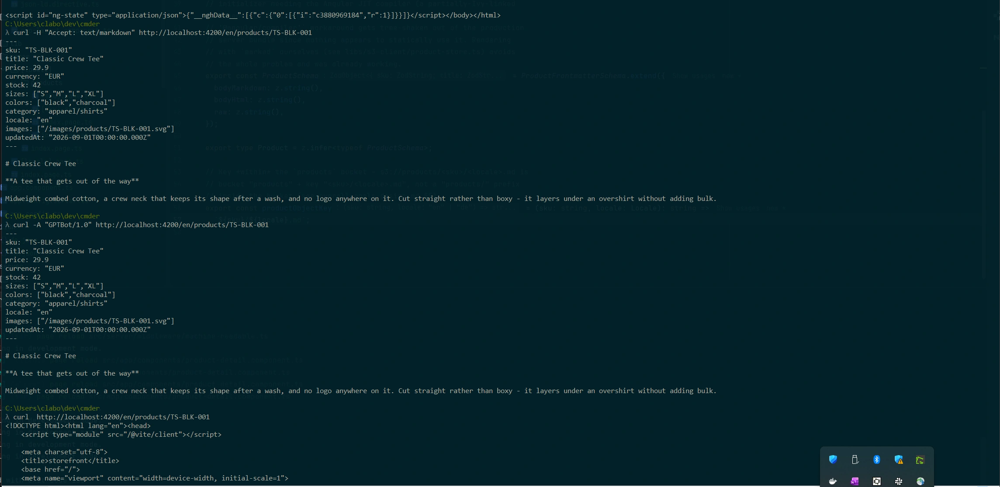

# analog-ecom-ws

A small, deliberately non-fancy storefront demo built to showcase two
things in combination:

- **AnalogJS's runtime i18n** — a landing page, product list, and product
  detail page, served in English and German from the same URL structure
  (`/en/...`, `/de/...`).
- **Serving the same product data two ways** — rendered HTML for a
  browser, raw markdown for an AI agent, both derived from one
  source-of-truth markdown file instead of one being scraped or converted
  from the other.

Product data lives as **markdown files with YAML frontmatter in S3**
(mocked locally via [Adobe S3Mock](https://github.com/adobe/S3Mock)) —
not a database. It's fetched at request time, not baked in at build time,
because the whole point is showing what a storefront looks like when its
catalog is genuinely dynamic instead of a static content collection.

This is a showcase repo, not a product. There's no cart, checkout, auth,
or real persistence — see [Non-goals](#non-goals).

**Used together, the way a real project would:** AnalogJS 2.7 (SSR, i18n,
`.server.ts` load functions, Nitro/h3 middleware), modern Angular 22
(standalone components, `OnPush` everywhere, `@defer`, signal inputs),
NgRx Signals, Zod, Tailwind v4 with [spartan.ng](https://spartan.ng) components, and a small
NestJS CLI in the same Nx workspace.

## The main goal

Most "serve markdown to AI agents" demos either (a) hand-convert existing
HTML pages back into markdown at request time, or (b) require a whole
separate CMS/content pipeline. This repo tries to make the point that
neither is necessary if markdown is the *source of truth* from the start:

```
S3: products/<sku>/<locale>.md  (frontmatter + markdown body)
          │
          ├─→ browser request  → rendered as an Angular page (HTML)
          ├─→ agent request    → returned as-is (raw markdown)
          ├─→ JSON-LD + meta description → built from the same parsed data
          └─→ llms.txt / sitemap → built from the same parsed data
```

One fetch, one parse, several different outputs — nothing is generated by
converting one of those outputs into another. The idea is a product-page
take on "serving markdown to agents", which is usually shown on blog posts.

## Quick start

Requires Node.js and Docker.

```sh
npm install
npm start
```

`npm start` runs the whole chain: starts S3Mock via Docker, seeds it with
a demo catalog (6 products, EN+DE), does a production build, and serves
the app at **http://localhost:3000**.

Stop it with Ctrl-C. Tear down S3Mock with `npm run docker:down` when
you're done.

`npm start` does a production build and serve; `npm run dev` runs the
Vite dev server (faster reload while editing pages). Both work for
everything below, including the agent-facing routes — but that wasn't
always true, see [Lessons learned](#lessons-learned). `npm start` remains
the closer-to-production path, and is what was used to verify most of this
repo's behavior.

## A guided tour

With the server running on port 3000:

**The storefront itself:**

| URL | What it is |
|---|---|
| `/` | redirects to `/en` |
| `/en`, `/de` | landing page, each language |
| `/en/products`, `/de/products` | product list, with a category filter |
| `/en/products/TS-BLK-001` | a product detail page |

**The agent-facing side — the actual point of this demo.** Same product
detail URL, three ways:

```sh
# A browser gets rendered HTML (the default)
curl http://localhost:3000/en/products/TS-BLK-001

# An agent that asks for markdown gets markdown, same URL
curl -H "Accept: text/markdown" http://localhost:3000/en/products/TS-BLK-001

# So does a known AI crawler user-agent, same URL again
curl -A "GPTBot/1.0" http://localhost:3000/en/products/TS-BLK-001

# Or an agent can just append .md and always get markdown, no headers needed
curl http://localhost:3000/en/products/TS-BLK-001.md
```

All three markdown responses are byte-identical to what's actually stored
in S3 — frontmatter and all. Nothing is converted; it's handed back as-is.



**Machine-readable indexes**, also built from the live catalog:

```sh
curl http://localhost:3000/llms.txt              # compact index → agent entry points
curl http://localhost:3000/sitemap-products.xml  # per-locale sitemap with hreflang alternates
curl http://localhost:3000/robots.txt            # explicit rules per bot class
```

**View source on a product page** and you'll also find a `schema.org`
`Product` JSON-LD block and a `<meta name="description">` in the `<head>`,
both built from the same parsed product data the page renders.

## Measured: HTML vs. markdown, in tokens

"An agent gets markdown instead of HTML" is a claim about token cost, so it
should be measured as one instead of just asserted. `scripts/measure-tokens.mjs`
fetches the same product detail URL both ways from a running instance and
counts tokens with [`gpt-tokenizer`](https://www.npmjs.com/package/gpt-tokenizer)
against two real encodings (`cl100k_base` — GPT-3.5/4 — and `o200k_base` —
GPT-4o and newer). Reproduce it against your own running server:

```sh
npm start                       # or npm run dev, in another terminal
npm run measure:tokens          # defaults to http://localhost:4200
npm run measure:tokens -- http://localhost:3000
```

Measured against a production build (`npm start`), `/products/TS-BLK-001`, both locales:

| Variant | Bytes | Chars | Tokens (cl100k_base) | Tokens (o200k_base / gpt-4o) |
|---|---:|---:|---:|---:|
| en — rendered HTML (raw response) | 28,517 | 28,511 | 7,739 | 7,739 |
| en — HTML, tags stripped (naive scrape) | 494 | 490 | 110 | 110 |
| en — markdown (`.md` route) | 506 | 506 | 158 | 158 |
| de — rendered HTML (raw response) | 28,687 | 28,657 | 7,799 | 7,799 |
| de — HTML, tags stripped (naive scrape) | 546 | 537 | 127 | 127 |
| de — markdown (`.md` route) | 536 | 532 | 168 | 168 |

Two different comparisons worth pulling apart here, because they tell
different stories:

- **Raw HTML response vs. markdown response: ~49x fewer tokens** (7,739 →
  158, `en`). This is the honest worst case for an agent that just does
  `fetch()` and hands the body to a model with no extraction step —
  Angular's hydration payload, inlined styles, and script tags are most of
  those 7,739 tokens, and none of it is product information. Content
  negotiation ([Serving markdown to agents](#serving-markdown-to-agents))
  means an agent never has to pay that cost or do that extraction — same
  URL, `Accept: text/markdown`, straight to the 158.
- **HTML with tags stripped (naive scrape) vs. markdown: markdown is
  *larger*** (158 vs. 110 tokens, `en`) — the one place the numbers don't
  favor markdown outright, and worth stating plainly rather than picking
  the comparison that flatters the repo. The reason is what's *in* each:
  the stripped-HTML column is only what's visually rendered (title, price,
  description prose). The markdown response is the complete source file —
  frontmatter and all — so it also carries `sku`, `stock`, `sizes`,
  `colors`, `category`, `images`, `updatedAt`: structured, typed fields
  that were never rendered as visible text at all, and that a scraper
  would otherwise have to re-infer from page markup (with no guarantee of
  getting `stock: 42` right, versus reading it as an actual field). The
  ~44% extra tokens buy strictly more information, already structured,
  guaranteed to match [the Zod-validated
  source](#product-content-model) — not the same information paid for
  twice.

The tags-stripped column is a crude regex extraction (script/style/comment
stripping + whitespace collapse), not a real readability implementation —
good enough to establish the order of magnitude, not a precise baseline.
Numbers will drift slightly release to release as dependencies update; the
script exists so re-measuring is a command, not a rewrite.

## Lighthouse: 100/100/100/100, and 3/3 on Agentic Browsing


That's a cold Lighthouse run against the product detail page, unthrottled
build, nothing special staged for the audit — the same production build
`npm start` serves. Worth showing because none of it is a coincidence; it
falls out of specific decisions made elsewhere in this README, not a
separate "make Lighthouse happy" pass:

- **Performance (100, CLS 0, TBT 0ms).** SSR + `provideClientHydration()`
  means the browser gets real, painted HTML on the first response instead
  of an empty shell waiting for JS — that's most of the 0.6s FCP right
  there. [`OnPush` everywhere](#ui-architecture) plus
  [explicit zoneless change detection](#ui-architecture) keep the runtime
  from doing speculative work on every event. Every `` (product cards,
  product detail) carries explicit `width`/`height` attributes, so the
  browser reserves layout space before the image loads — that's the `0`
  CLS, not luck. And the [barrel-export bug that was quietly shipping Zod
  to the browser](#lessons-learned) is exactly the kind of thing that
  erodes this number silently over time if nobody looks at built chunk
  sizes; it's fixed now, but it's a good example of how a 100 doesn't stay
  a 100 on its own.
- **Accessibility (100).** Comes mostly for free from
  [spartan.ng's `brain` primitives](#spartanng-components) doing the
  unglamorous work: the toggle groups (locale/size/color pickers) get
  roving keyboard focus and pressed-state semantics instead of a `<div
  (click)>` soup, and the breadcrumb renders as a real `nav` landmark with
  `aria-current` on the active crumb and `aria-hidden` separators. Every
  product image has a real `[alt]` (bound to the product title, not a
  static placeholder) — small, but it's the kind of thing that's easy to
  skip on a demo and didn't get skipped here.
- **Best Practices (100) / SEO (100).** Structured data and metadata are
  generated from the same parsed product object the page renders — see
  [Structured data & SEO](#structured-data--seo) — so there's no separate,
  driftable "SEO version" of the content to get out of sync. The
  [locale guard](#i18n) exists specifically because an earlier Lighthouse
  SEO audit caught unknown paths like `/robots.txt` rendering as a bogus
  locale page — this repo's SEO 100 already survived one real regression.
- **Agentic Browsing (3/3).** This is a newer Lighthouse category
  (shipped in Lighthouse 13.3, May 2026) that scores a page not against a
  human visitor but against an *agent* trying to read and act on it — it
  checks for an `llms.txt`, WebMCP tool definitions, the quality of the
  accessibility tree (which is the data model an agent actually sees), and
  layout stability, and reports a pass ratio rather than a 0–100 score.
  This repo passes all 3 *applicable* checks: [`llms.txt` is served at the
  root](#serving-markdown-to-agents), the accessibility tree is clean (the
  same primitives and labeling behind the Accessibility 100 above), and
  CLS is 0. It's 3/3 and not 4/4 because the fourth check, WebMCP, isn't
  wired up here — see [Not built (yet)](#not-built-yet) for the
  considered, not-yet-implemented cart/WebMCP idea.

**Why this belongs in this README specifically:** the whole premise of this
repo is that a storefront can be genuinely legible to an agent — served
markdown, `llms.txt`, structured data — without that being bolted on as a
separate pipeline. Lighthouse shipping a category that measures exactly
that claim, from an external, vendor-neutral tool rather than this
project's own say-so, is about as close to independent validation of the
thesis as a showcase repo can get. A11y/SEO/Performance scores would matter
for any app; the Agentic Browsing score is the one that's actually *about*
what this repo is trying to prove.

## How it works

### Product content model

One object per product per locale, so each language version is a complete,
independently fetchable markdown document (authored per language, not
translated at render time):

```
s3://products/<sku>/en.md
s3://products/<sku>/de.md
```

Each file is YAML frontmatter plus a markdown body:

```yaml
---
sku: "TS-BLK-001"
title: "Classic Crew Tee"      # product name, localized per file
price: 29.9
currency: "EUR"                # always EUR, in every locale
stock: 42
sizes: ["S","M","L","XL"]
colors: ["black","charcoal"]
category: "apparel/shirts"
locale: "en"                   # matches the filename, kept for validation
images: ["/images/products/TS-BLK-001.svg"]
updatedAt: "2026-09-01T00:00:00.000Z"
---

# Classic Crew Tee

**A tee that gets out of the way**

Midweight combed cotton, a crew neck that keeps its shape after a wash...
```

That Markdown *is* the source of truth — not a CMS export, and not an HTML
page reverse-engineered back into markdown.

- **One schema.** `libs/product-schema` holds the Zod schema for that
  frontmatter. The ingest CLI validates against it before writing, and the
  storefront validates against it after reading, so the two can't drift.
- **One fetch function.** `libs/s3-client` exports `getProduct` /
  `listProducts` / `getProductRaw`. Every consumer calls those — page load
  functions, the negotiation middleware, the `.md` route, `llms.txt`, the
  sitemap. Nothing re-implements S3 access or frontmatter parsing (it's
  `front-matter` + `marked`, with the frontmatter validated against the Zod
  schema; the load functions catch failures and fall back to an empty result
  instead of throwing).
- **Why runtime, not Analog's content collections.** `injectContent` &
  friends are built around markdown sitting in `src/content` at *build*
  time. Piping S3 through that would mean syncing S3 → local files before
  every build, at which point "ephemeral, S3-backed data" stops being true.
  Product pages use Analog's `.server.ts` load functions
  (`injectLoad<typeof load>()`), which is already the idiomatic "fetch on
  the server before rendering" mechanism.
- **Images live on disk, not in S3.** Product images are static assets in
  `apps/storefront/public/images/products/`, referenced by path from the
  frontmatter. S3 stays scoped to what the demo is about — ephemeral,
  agent-legible product *data*. A real storefront would put images on a CDN.

### Serving markdown to agents

All of it lives in `apps/storefront/src/server/`, as plain Nitro/h3
middleware:

- **Content negotiation, same URL.** `/<locale>/products/<sku>` checks
  `Accept: text/markdown` first — UA-agnostic, and the primary way to demo
  this. A deliberately small, illustrative user-agent list (GPTBot,
  ClaudeBot, PerplexityBot) also works, purely to show the pattern; it is
  not an exhaustive or current bot registry. A match returns the raw S3
  object with `content-type: text/markdown`; everything else falls through
  to the normal Angular route.
- **Always-markdown sibling route.** `/<locale>/products/<sku>.md` returns
  the same raw markdown regardless of headers, for agents that just try
  appending `.md`.
- **No HTML→markdown conversion, anywhere.** Markdown is always the
  source; HTML is always derived from it, never the reverse.
- **`llms.txt`** is generated per request from `listProducts()`: a short
  site description, the landing pages, then one line per product per
  locale linking straight to the `.md` route — handing an agent the
  markdown entry point instead of making it discover content negotiation.
- **`robots.txt`** names every bot class explicitly instead of relying on
  `*`: classic search crawlers, AI search/retrieval crawlers (OAI-SearchBot,
  Claude-SearchBot, PerplexityBot…), user-triggered agents (ChatGPT-User,
  Claude-User, Perplexity-User…), and model-training crawlers (GPTBot,
  ClaudeBot, Google-Extended, CCBot…). Everything is allowed by default,
  since serving agents is the point of the demo; one constant
  (`ALLOW_TRAINING_CRAWLERS` in `server/lib/robots-txt.ts`) opts out of
  training crawls only. Worth knowing: robots.txt is advisory, some
  user-triggered fetchers are documented by their vendors as not bound by
  it, and browser-driving agents send a plain Chrome user-agent and can't
  be addressed by it at all. The bot list is a snapshot of documented
  user-agent tokens, not a maintained registry.

The negotiation logic is h3-only and deliberately not framework-portable or
extracted into a package: `wantsMarkdown()` is one small isolated module
(`server/lib/wants-markdown.ts`), kept separate from the route-handling
glue so it *could* be lifted out later — but there's exactly one consumer
today, so it stays where it is ("use before reuse").

### Structured data & SEO

- **JSON-LD `Product`** on the detail page (name, sku, image, `offers` with
  price/currency/availability derived from `stock`), built from the same
  validated product the page renders. It's written by `JsonLdDirective`
  through `Renderer2` in an `effect()` — Angular strips literal `<script>`
  elements from templates, and the effect (not a constructor) matters
  because the router reuses the component between `/products/:skuA` and
  `/products/:skuB`.
- **Meta descriptions**, localized per page: the landing page reuses the
  hero subheading's translation, the product list has its own string, and
  product pages derive theirs from the product's markdown body
  (`lib/product-description.ts`, shared with the JSON-LD `description` so
  the two can't drift).
- **Sitemap.** Product routes aren't known at build time — they live in
  S3 — so `/sitemap-products.xml` is generated per request from the live
  catalog, with `<xhtml:link rel="alternate" hreflang>` entries per locale.

### i18n

- **Locales:** `en` (default) and `de`, path-prefixed through a `[locale]`
  route segment, configured with the `analog()` Vite plugin's
  `i18n: { defaultLocale, locales }` option.
- **UI chrome** (nav, buttons, labels) uses `$localize` with `provideI18n()`
  and one JSON catalog per locale (`src/i18n/en.json`, `de.json`).
- **Product content** doesn't go through `$localize` at all: the locale in
  the URL directly selects which S3 object (`en.md` vs `de.md`) to fetch.
  Product content is data, not a UI string catalog.
- **Locale switcher:** `injectSwitchLocale()`, once, in the shared layout's
  header. Switching is a full navigation rather than an in-place re-render.
- **Unknown locales are rejected.** Analog's `[locale]` segment matches
  *anything*, so without a guard `/robots.txt` or `/favicon.ico` rendered
  the landing page nested under a bogus locale (found via a Lighthouse SEO
  audit). `[locale].page.ts` redirects anything outside `en`/`de`.
- **Currency** is fixed to EUR for both locales — no fake exchange rate —
  but still goes through `Intl.NumberFormat` so `en` renders `€29.90` and
  `de` renders `29,90 €`.

**Discussion: runtime vs. build-time localization.** Worth being precise
about what "build-time" means here, because it's really two different
mechanisms that get conflated:

- **Angular CLI's classic i18n** (`ng build --localize`) compiles a
  *separate application bundle per locale*: `$localize` messages get
  swapped for their translations at compile time, and the output is N
  distinct, self-contained bundles with zero i18n runtime machinery in any
  of them — no JSON fetch, no locale lookup, nothing to get out of sync at
  request time.
- **AnalogJS's own i18n** (`@analogjs/router/i18n`, what this repo
  actually uses) is a different design: *one* bundle handles every
  configured locale. `$localize`/`i18n="@@id"` is still used in templates
  (see the `nav.home`, `home.heading`, etc. message IDs throughout
  `apps/storefront/src/app`), but only for *extraction* — the actual
  translation happens at runtime, resolved per request by
  `provideI18n()`'s `loader` (here, `import('../i18n/${locale}.json')` in
  `app.config.ts`). Analog does support a build-time-*ish* layer on top of
  this — `prerender: { routes, sitemap }` combined with the `i18n` config
  generates locale-prefixed static HTML (`/en/about`, `/de/about`, …) at
  build time — but it does that by running the *same* runtime-capable
  bundle once per locale during the build, not by compiling N separate
  bundles the CLI way.

So "even build-time would be possible with `$localize`" is half right:
Analog's prerender step is exactly that build-time option, and it would
work fine for genuinely static routes here (the landing page, for
instance). It doesn't extend to this repo's product routes, though, for
the same reason [product content stays out of Analog's content
collections](#product-content-model): `/<locale>/products/<sku>` isn't a
known, finite set at build time — the catalog lives in S3 and can change
without a rebuild. Prerendering can't enumerate routes it doesn't know
exist yet. Baking those pages at build time would mean re-baking on every
catalog change, which is exactly the "ephemeral, S3-backed data" premise
this whole repo is built to avoid.

**Locale-specific images are already possible, independent of any of
this.** That part of the idea doesn't actually depend on runtime vs.
build-time localization at all — `en.md` and `de.md` are already two
separate frontmatter documents (see [Product content
model](#product-content-model)), each with its own `images` array. A
German file pointing at a different (or differently localized) image than
its English sibling would work today, unchanged, under the current runtime
i18n setup. Nothing about that needs compile-time bundle splitting.

What real build-time bundle splitting *would* buy over the current setup:
slightly less shipped to the client (the i18n catalogs are already tiny —
`en.json`/`de.json` compile down to ~0.4 kB gzip each, their own chunks in
the [bundle analysis above](#lessons-learned)) and translation-key typos
caught at compile time instead of surfacing as a missing string at
runtime. What it would cost: N separately built, versioned, deployed
server bundles instead of the one Nitro process this app runs today — a
real operational trade for a win this small at a 2-locale, 6-product
scale. Not pursued here for that reason, not because it's unsupported.

### UI architecture

- **One layout.** `AppLayoutComponent` wraps every `[locale]` route
  (header, breadcrumb, `<router-outlet>`, footer with a link to
  `llms.txt`). Its template and styles are inline in the `.ts` file — it's
  the one shell component, so co-location keeps it in one place.
- **`OnPush` on every component**, standalone throughout. The landing page
  uses one `@defer (on viewport)` block for its secondary section.
- **Zoneless**, explicitly. `provideZonelessChangeDetection()` in
  `app.config.ts` — `zone.js` was never actually a dependency (not in
  `package.json`, not in `node_modules`; only a peer-dependency mention in
  the lockfile), so the app was already running on Angular's implicit
  no-zone fallback. Declaring it turns that into the real zoneless
  scheduler instead, which is what the OnPush/signals architecture here was
  already built for. No bundle-size change from this (`zone.js` was never
  shipped either way) — this is a correctness/explicitness fix, not a
  size one.
- **State is as small as it can be.** Almost everything is a plain
  `computed()` derived from the loaded product. The size/color picker on
  the detail page is the one place with genuinely *owned* local state, so it
  uses `signalState` + `patchState`, with an `effect()` that resets it when
  the product input changes (again, the router reuses the component
  instance). The one piece of truly cross-component state is the breadcrumb
  trail: `AppLayoutComponent` renders it but only the active page knows what
  it should say, so `BreadcrumbStore` (a `signalStore`) holds it. There is
  no global app state — no cart, no auth.
- **No `rxMethod`.** Search was cut from scope, which left no debounced
  input for it to serve, and it isn't worth adding just to tick a box.

### spartan.ng components

spartan splits each component into a headless **brain** primitive (behaviour
and accessibility, from `@spartan-ng/brain`) and a **helm** layer (Tailwind
styling) that the CLI *copies into your repo* instead of shipping as a
dependency. Here the helm code lives in `libs/ui/<primitive>` (config in
`components.json`), imported as `@spartan-ng/helm/<primitive>`, and is ours
to edit. Five primitives are used, each replacing hand-written markup:

| Primitive | Used for |
|---|---|
| `button` | landing call-to-action, "Back to products" (`hlmBtn` on `<a>`) |
| `card` | product cards, landing category tiles (`hlmCard` on `<a>`) |
| `badge` | category label, stock status |
| `breadcrumb` | the trail rendered by `BreadcrumbStore` (nav landmark, `aria-current`, decorative separators) |
| `toggle-group` | locale switcher, size picker, color picker |

The size/color pickers are the interesting one: a single-select toggle
group gives roving keyboard focus and pressed-state semantics that the old
hand-styled buttons didn't have, and it binds straight to the existing
`signalState` selection. Two local edits to the copied code: selected items
are filled with the primary color (the stock "on" state was too faint on
this background), and the stock badge's brand-accent color is applied as a
plain `class` override, which spartan merges over the variant with
`tailwind-merge`.

**Discussion: is this heavier than shadcn/daisyUI?** At the code level, no
— spartan's CLI copies plain source files into your repo exactly like
`npx shadcn add button`; you own and edit them from there, not a package
you `npm update`. `libs/ui/button`'s actual code is two small files,
`hlm-button.ts` and `hlm-button.token.ts`. What *is* heavier here is
packaging, not philosophy: `components.json` has `"generateAs": "library"`,
so in this Nx workspace the CLI wraps every copied primitive in a full Nx
library — `project.json`, `tsconfig.json`, `tsconfig.lib.json`,
`eslint.config.mjs`, `README.md` — per component, on top of those one or
two source files. That buys independent lint/build targets and
tree-shakeable, path-mapped imports (`@spartan-ng/helm/<primitive>` via
`tsconfig.base.json`) if the workspace ever wants per-component Nx
targets; for a single app like this one, it's ceremony this repo doesn't
exploit. `components.json` also supports `"generateAs": "directory"`,
which drops the Nx-library scaffold and just places files under
`libs/ui/<name>` — closer to shadcn's flat-file feel. Not switched here
because it wasn't worth the churn on an already-generated set of
components, but it's the knob to reach for if the current structure feels
like more than the workspace needs.

### Routes

| Route | Served by |
|---|---|
| `/` | redirect to `/en` |
| `/<locale>` | landing page |
| `/<locale>/products` | product list (`.server.ts` load function, category filter via query param) |
| `/<locale>/products/<sku>` | product detail — HTML, or markdown if negotiated |
| `/<locale>/products/<sku>.md` | always raw markdown |
| `/llms.txt` | request-time index → product `.md` routes |
| `/sitemap-products.xml` | request-time sitemap of the live catalog |
| `/robots.txt` | per-bot-class rules |

### Local infrastructure

`docker-compose.yml` runs S3Mock with a `products` bucket on port 9090.
The storefront and the ingest CLI both talk to it through the shared
`s3-client` lib (path-style addressing, endpoint from env vars rather than
hardcoded). One trap: the bucket-creation env var is
`COM_ADOBE_TESTING_S3MOCK_STORE_INITIAL_BUCKETS`. The plain
`INITIAL_BUCKETS` was deprecated in S3Mock 4.5.0, and with the old name the
bucket silently never gets created — no error, just an empty bucket list.

## Re-seeding

Storage is deliberately ephemeral — that's the point (a real catalog would
be genuinely dynamic, not baked into the build). Reset it any time:

```sh
npm run seed:clear   # empty the bucket
npm run seed         # push the 6-product demo catalog back in (EN+DE)
```

The catalog and its EN/DE copy are hand-authored fixtures in
`apps/product-ingest/src/app/fixtures.ts` — 6 products across 2 categories
(3 shirts, 3 shoes), not fetched from anywhere external, and not generated
by an LLM. Placeholder product images are generated SVGs (no stock photos,
no licensing questions), written to
`apps/storefront/public/images/products/` by the same seed command.

## Project structure

```
apps/
  storefront/              AnalogJS app — the actual storefront
    src/app/
      pages/                 file-based routes (see below)
      components/            presentational components (Header, Footer,
                              Breadcrumb, ProductCard, ProductDetail),
                              built on the spartan components in libs/ui
      layout/                AppLayoutComponent - the shared shell
      directives/            JsonLdDirective
      stores/                BreadcrumbStore
      lib/                   small pure helpers (price formatting,
                              product description)
    src/i18n/                en.json / de.json UI string catalogs
    src/server/
      middleware/            content negotiation, llms.txt, sitemap, robots.txt
      lib/                   Accept-header/user-agent detection, robots.txt rules

  product-ingest/          NestJS CLI (nest-commander) - seeds S3Mock,
                            not a running service. `nx run product-ingest:seed`

libs/
  product-schema/          Zod schema for the frontmatter contract -
                            shared by both apps so ingest/read can't drift
  s3-client/               The one shared S3 fetch/parse function - every
                            consumer above (pages, negotiation, llms.txt,
                            sitemap) calls the same getProduct/listProducts
  ui/                      spartan.ng helm components, copied in by the
                            spartan CLI (button, card, badge, breadcrumb,
                            toggle-group + shared utils) - one Nx lib each

components.json           spartan CLI config (where helm code goes, style)
docker-compose.yml        S3Mock, the only external dependency
```

Routes, file-by-file, under `apps/storefront/src/app/pages/`:

```
index.page.ts                          /  → redirects to /en
[locale].page.ts                       shared layout + locale guard for every /:locale/* route
[locale]/index.page.ts                 /:locale            landing page
[locale]/products/index.page.ts        /:locale/products    product list
[locale]/products/[sku].page.ts        /:locale/products/:sku    product detail
```

Product list/detail pages each have a sibling `.server.ts` file — Analog's
load-function convention — which is where the S3 fetch actually happens,
server-side, before the page renders.

## Tech stack

| Layer | Choice |
|---|---|
| Monorepo | Nx workspace |
| Meta-framework | [AnalogJS](https://analogjs.org) 2.7 (Angular 22, Vite, Nitro/h3) |
| Components & styling | [spartan.ng](https://spartan.ng) (`brain` headless primitives + copy-owned `helm` styling, in `libs/ui`) on Tailwind v4, themed through spartan's `hlm-tailwind-preset` |
| State | `@ngrx/signals` — `signalState` for owned local state, `signalStore` for the breadcrumb trail; plain `computed()` for everything derived |
| Schema/validation | Zod, shared between the ingest CLI and the storefront |
| i18n | AnalogJS's native runtime i18n (`provideI18n`, `[locale]` route segment) |
| Product storage | S3-compatible object storage (Adobe S3Mock), ephemeral |
| Content parsing | `front-matter` + `marked` |
| Ingest tool | NestJS CLI (`nest-commander`) |

## Lessons learned

Real problems hit while building this, with root causes rather than just
workarounds — most of them are the kind of thing that only shows up when
several of these tools are used together.

- **Analog's dev server never sends a middleware handler's return value.**
  The negotiation/`llms.txt`/sitemap middleware hung forever under
  `nx serve` while working fine in a production build. Cause, found in
  `@analogjs/vite-plugin-nitro`'s dev-mode runner: it calls each
  `server/middleware/*.ts` handler directly and only inspects the *return
  value* to decide whether to call `next()` (`if (!result) next()`) — it
  never writes that value to the response. Auto-serialization of returned
  values only happens in Nitro's real production pipeline. **Fix:** call
  h3's `send(event, body, contentType)` explicitly, then `return true` so the
  chain doesn't continue into Angular's renderer on an already-closed
  response. Any non-pass-through middleware here should do the same.
- **Vite and Nitro resolve modules separately.** `vite-tsconfig-paths` didn't
  resolve the workspace libs in the SSR module runner despite a correct
  `extends` chain, and Nitro (which runs `.server.ts` load functions and
  middleware) has an entirely separate resolution pipeline that ignores
  Vite's `resolve.alias`. Fix: explicit aliases for both workspace libs,
  given to Vite *and* repeated under `analog({ nitro: { alias } })`. The
  spartan helm libs hit the same wall (`@spartan-ng/helm/*` failed in SSR
  despite correct `tsconfig` paths); one pattern alias in `vite.config.ts`
  covers all of them (Vite only — Nitro never imports components).
- **Nx's default `appsDir` is the workspace root.** Without setting
  `workspaceLayout` in `nx.json` *before* generating, Analog's generator
  scaffolds at the root instead of under `apps/`.
- **Two spartan/Tailwind traps.** (1) Tailwind v4 only auto-scans the app,
  so the copied helm classes in `libs/ui` need an explicit
  `@source "../../../libs/ui"` in `styles.css` — and it must sit *below*
  every `@import`: CSS ignores `@import` rules that follow other rules, so
  placed above the spartan preset import it silently drops the preset and
  fails with a confusing `Cannot apply unknown utility class border-border`.
  (2) A toggle group's `nullable` input defaults to `true`, so re-clicking
  the selected size deselected it and left the UI out of sync with the
  `signalState` behind it; the pickers set `[nullable]="false"`.
- **Angular strips literal `<script>` elements from templates** — even
  static ones — so JSON-LD has to be written through `Renderer2`.
- **A page can't have both a component and `redirectTo`.** Analog's
  generated route always sets `component`, so a pure-redirect page throws
  `NG04014` unless it exports no default component at all.
- **`<analog-markdown>` broke SSR here.** Rendering product bodies with
  Analog's own component seemed like a clean fit but tripped an SSR-breaking
  incompatibility in this Vite/Nitro AOT build (a partially-Ivy-linked
  dependency needing the JIT compiler, which gets tree-shaken out of the
  production server bundle). Tried, reverted, and rendered with `marked`
  instead.
- **Dark mode CSS existed but was never activated.** `styles.css` had a
  full `:root.dark { ... }` variable set from the start, but nothing ever
  added a `dark` class anywhere, and no `@media (prefers-color-scheme)`
  fallback existed either — so the app was permanently light. Complicating
  a "just use a media query" fix: spartan's `hlm-tailwind-preset.css`
  redefines Tailwind's `dark:` variant as `@custom-variant dark
  (&:is(.dark *))` — class-based, not `prefers-color-scheme` — and three
  helm components (`hlm-button`, `hlm-badge`, `hlm-toggle`) use `dark:`
  utilities directly. So the CSS variables have to stay keyed off `.dark`
  too. Fixed with a small inline script in `index.html`, run before first
  paint, that sets `.dark` on `<html>` from
  `matchMedia('(prefers-color-scheme: dark)')` and keeps it in sync on
  change — OS-driven, no manual toggle in the UI.
- **A barrel export silently shipped Zod to the browser.** A production
  build showed `_locale_.page-*.js` — the shared layout chunk loaded on
  *every* route — at 99.5 kB / 29.4 kB gzip, disproportionate for a
  component that just renders header/breadcrumb/footer. `libs/product-schema`
  exports both plain constants (`LOCALES`) and Zod schemas from one barrel
  (`export * from './lib/product-schema'` in `index.ts`), and that file
  does `import { z } from 'zod'` at module scope. `AppLayoutComponent` and
  `[locale].page.ts` only ever value-import `LOCALES` — everything else
  they take from that module is `import type`, which erases — but because
  a bundler can't prove `z.object(...)` calls are side-effect-free, the
  barrel re-export pulled in the whole Zod schema graph anyway, and this
  build's Rollup config didn't shake it back out even after `LOCALES` was
  moved to its own zod-free file (`libs/product-schema/src/lib/locales.ts`)
  — the barrel indirection alone was enough to defeat tree-shaking here.
  Confirmed the mechanism empirically: importing that file by a direct
  relative path (bypassing the barrel entirely) shrank the chunk to
  12.5 kB / 4.6 kB gzip and removed every trace of Zod (`ZodError`,
  `ZodObject`, …) from the build output. Fixed properly with a second path
  alias, `@analog-ecom-ws/product-schema/locales` (in both
  `tsconfig.base.json` and `vite.config.ts`'s `workspaceLibAliases`,
  ordered before the bare specifier), so the two client call sites resolve
  straight to the zod-free file without a relative-path escape hatch.
  Net: ~87 kB raw / ~25 kB gzip off every route's initial load. Worth
  remembering generally: a barrel that mixes side-effecting and pure
  exports can force-include the side-effecting half even when only the
  pure half is imported as a value — measure with the actual built output,
  not just source-level `import type` discipline.
- **S3Mock fails quiet.** The deprecated bucket env var creates no bucket
  and reports no error (see [Local infrastructure](#local-infrastructure)).
  It only showed up by querying the running container, not by the code
  looking plausible — which is why this repo is verified by hand and by
  `curl` against a real S3Mock instead of only being typechecked.

## Scripts reference

| Script | What it does |
|---|---|
| `npm start` | docker up → seed → production build → serve (**use this**) |
| `npm run dev` | docker up → seed → Vite dev server (fast reload for editing pages) |
| `npm run docker:up` / `docker:down` | start/stop S3Mock |
| `npm run seed` / `seed:clear` | push/clear the demo catalog |
| `npm run storefront:build` | production build only |
| `npm run storefront:dev` | Vite dev server only (no docker/seed step) |

## Non-goals

No cart, checkout, payment, or auth. No real persistence layer — S3Mock is
the only store, and data is expected to be reseeded on demand. No
production security or performance hardening. No real search (the category
filter on the product list follows two static links, not a search box — a
6-product catalog doesn't need one). No automated tests: this is a
showcase repo, verified by hand and by `curl` against a real running
S3Mock throughout its build, not by a test suite.

## Not built (yet)

- **Open Graph image generation.** Analog ships `ImageResponse`
  (`@analogjs/content/og`, on satori) for rendering a per-product OG image
  from an API route; it isn't wired up, so product pages have no `og:image`.
- **Streaming SSR.** Analog's `experimental.streaming` option with
  `@defer (hydrate on viewport)` would progressively flush the response;
  still a stretch goal, not attempted.
- **A `<link rel="alternate" type="text/markdown">` hint** on rendered
  product pages, pointing at the `.md` route.

A fake (client-only, no backend) cart is also being considered — not for
the cart itself, but to give
[WebMCP](https://github.com/webmachinelearning/webmcp) something concrete
to expose (`add_to_cart`, `view_cart`), as the action-taking complement to
the content-serving agent showcase above.
